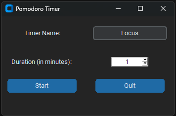

# Python Pomodoro Timer

A quick iteration of a pomodoro timer, using SQLite3 to store how many have been completed.
Uses CustomTkinter and plyer for display/notifications


## Screenshots




## Installation


```bash
  clone the repository
  cd pomodorotimer
  pip install -r requirements.txt
  python timer_gui.py
```
    
## Lessons Learned

- CustomTkinter used, follows the same as Tkinter but adds a modern look

